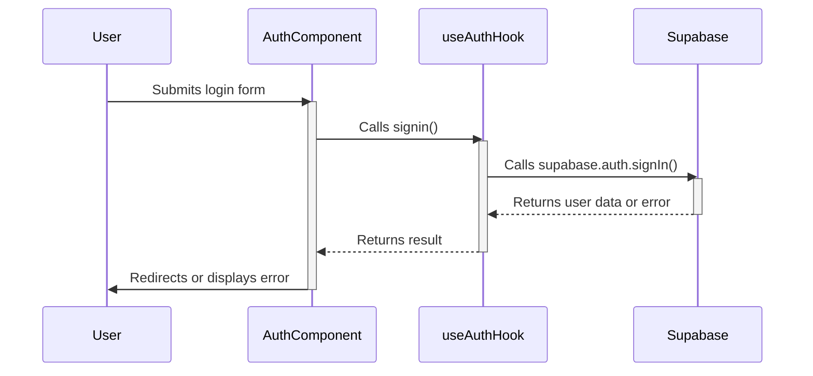

<details>
<summary>Relevant source files</summary>

The following files were used as context to generate this wiki page:

- [src/pages/Auth.tsx](https://github.com/GuilhermeDReis/tecido-lote-gestor/blob/main/src/pages/Auth.tsx)
- [src/hooks/useAuth.tsx](https://github.com/GuilhermeDReis/tecido-lote-gestor/blob/main/src/hooks/useAuth.tsx)
</details>

# Authentication

This document details the authentication system used in the `tecido-lote-gestor` application.  It leverages Supabase for user management and authentication, providing email-based login and signup functionality.  The system manages user sessions and provides access to user profile information.

## Authentication Flow

The authentication flow is primarily handled by the `useAuth` hook, which interacts with the Supabase client. The `Auth.tsx` component uses this hook to manage the user interface for login and signup.

### `useAuth` Hook

This hook encapsulates the core authentication logic, exposing functions for signing up, logging in, and managing user sessions.

```typescript
// src/hooks/useAuth.tsx

const useAuth = () => {
  // ... other code ...

  const signin = async ({ email, password }: any) => {
    // ... Supabase signin logic ...
  }

  const signup = async ({ email, password }: any, nome: any) => {
    // ... Supabase signup logic ...
  }

  // ... other code ...

  return {
    signin,
    signup,
    // ... other returned functions/values
  };
};
```

### `Auth.tsx` Component

This component provides the user interface for interacting with the authentication functions provided by the `useAuth` hook.

```typescript
// src/pages/Auth.tsx

const Auth = () => {
  const { signin, signup, loading } = useAuth();

  // ... form handling and state management ...

  const handleLogin = async (e: any) => {
    e.preventDefault();
    // ... login logic using signin from useAuth ...
  };

  const handleRegister = async (e: any) => {
    e.preventDefault();
    // ... registration logic using signup from useAuth ...
  };

  return (
    // ... JSX for login/signup form ...
  );
};

```

## Sequence Diagram

The following sequence diagram illustrates the interaction between the `Auth.tsx` component and the `useAuth` hook during the login process.




## Supabase Integration

The `useAuth` hook directly interacts with the Supabase client library for authentication.  Key Supabase functions used include `supabase.auth.signIn()` and `supabase.auth.signUp()`.  The hook also manages the user session and provides access to user profile data.

## Data Model

The user data is managed by Supabase. The relevant fields used in the application are:

| Field      | Description                               |
| ----------- | ----------------------------------------- |
| `id`       | Unique identifier for the user.          |
| `email`    | User's email address.                   |
| `name`    | User's name.                   |
| `password` | User's password (handled by Supabase).  |


## Future Considerations

- Implementing more robust error handling and user feedback.
- Adding support for other authentication methods (e.g., social login).
- Integrating with other Supabase features, such as row-level security.
