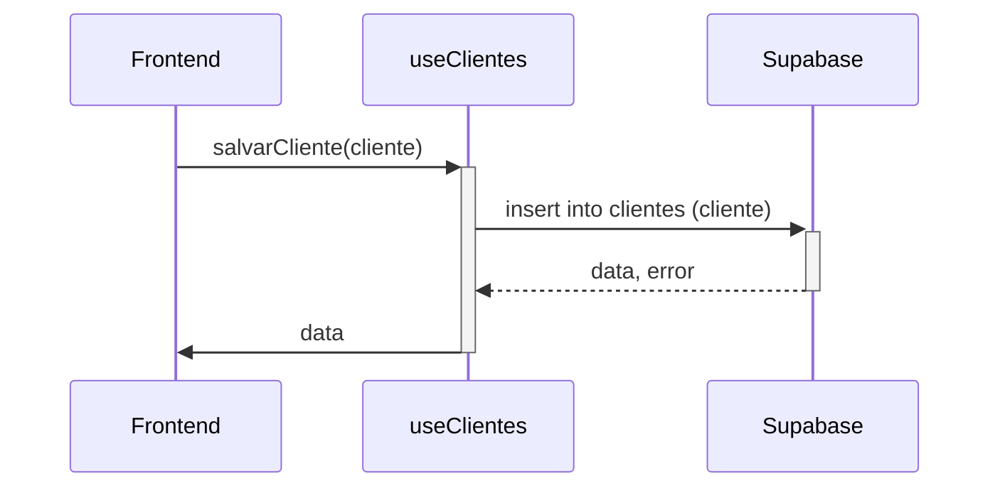

<details>
<summary>Relevant source files</summary>

- [src/integrations/supabase/client.ts](https://github.com/guilhermedreis/tecido-lote-gestor/blob/main/src/integrations/supabase/client.ts)
- [src/hooks/useClientes.ts](https://github.com/guilhermedreis/tecido-lote-gestor/blob/main/src/hooks/useClientes.ts)
- [src/hooks/useLotes.ts](https://github.com/guilhermedreis/tecido-lote-gestor/blob/main/src/hooks/useLotes.ts)
</details>

# Banco de Dados e Estrutura de Dados

O módulo "Banco de Dados e Estrutura de Dados" no projeto *tecido-lote-gestor* é fundamental para a gestão das informações relacionadas a clientes e lotes de tecido. Este módulo utiliza o Supabase como backend, permitindo operações de armazenamento, recuperação e manipulação de dados de forma eficiente. O foco principal deste documento é descrever a estrutura de dados, as interações com o banco de dados e as funcionalidades implementadas.

## Arquitetura do Banco de Dados

O banco de dados é estruturado para gerenciar duas entidades principais: **clientes** e **lotes**. Abaixo estão as tabelas e suas respectivas colunas:

### Tabela de Clientes

| Campo      | Tipo       | Descrição                        |
|------------|------------|----------------------------------|
| `id`       | string     | ID único do cliente              |
| `nome`     | string     | Nome do cliente                  |
| `created_at`| timestamp | Data de criação                  |
| `updated_at`| timestamp | Data da última atualização       |

### Tabela de Lotes

| Campo             | Tipo       | Descrição                         |
|-------------------|------------|-----------------------------------|
| `id`              | string     | ID único do lote                  |
| `codigo_lote`     | string     | Código identificador do lote      |
| `cliente_id`      | string     | ID do cliente associado           |
| `created_at`      | timestamp  | Data de criação                   |
| `updated_at`      | timestamp  | Data da última atualização        |

## Interações com o Banco de Dados

As interações com o banco de dados são abstraídas por meio de hooks personalizados que facilitam a manipulação dos dados.

### Hook `useClientes`

Este hook gerencia todas as interações relacionadas aos dados de clientes. As principais funcionalidades incluem:

- **`salvarCliente(cliente: Cliente)`**: Insere um novo cliente na tabela `clientes`.
- **`atualizarCliente(id: string, cliente: Partial<Cliente>)`**: Atualiza os dados de um cliente existente.
- **`excluirCliente(id: string)`**: Remove um cliente da tabela.
- **`buscarClientes(termo: string)`**: Busca clientes com base em um termo de pesquisa.

#### Exemplo: Salvando um Novo Cliente

```typescript
// src/hooks/useClientes.ts
const salvarCliente = async (cliente: Cliente) => {
  try {
    const { data, error } = await supabase
      .from('clientes')
      .insert([cliente])
      .select()
      .single();

    if (error) {
      throw error;
    }

    return data;
  } catch (error) {
    // Tratamento de erro
  }
};
```

### Hook `useLotes`

Este hook é responsável por gerenciar interações relacionadas aos lotes. As funcionalidades incluem:

- **`salvarLote(lote: Lote)`**: Insere um novo lote na tabela `lotes`.
- **`buscarLotePorCodigo(codigo: string)`**: Recupera um lote com base no seu código.
- **`carregarLotes()`**: Carrega todos os lotes disponíveis.

#### Exemplo: Buscando um Lote pelo Código

```typescript
// src/hooks/useLotes.ts
const buscarLotePorCodigo = async (codigo: string): Promise<Lote | null> => {
  const { data, error } = await supabase
    .from('lotes')
    .select('*')
    .eq('codigo_lote', codigo)
    .maybeSingle();

  if (error) {
    return null;
  }

  return data;
};
```

## Fluxo de Dados

O fluxo de dados entre o frontend e o banco de dados é mediado pelos hooks que interagem com o Supabase. O diagrama abaixo ilustra essa interação:



## Conclusão

O módulo "Banco de Dados e Estrutura de Dados" fornece uma base sólida para a gestão de informações dentro do *tecido-lote-gestor*. Através da utilização do Supabase, o projeto garante uma estrutura robusta para armazenar e manipular dados de clientes e lotes, permitindo que a aplicação funcione de maneira eficiente e escalável. As interações implementadas através dos hooks personalizados simplificam o acesso e a manipulação dos dados, promovendo uma experiência de desenvolvimento mais ágil e organizada.