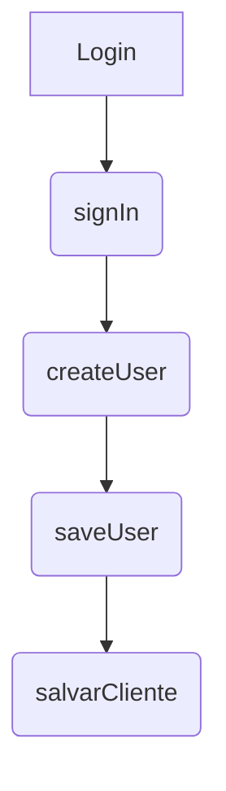

<details>
<summary>Relevant source files</summary>

- [.gitignore](https://github.com/guilhermedreis/tecido-lote-gestor/blob/main/.gitignore)
- [docsteste/overview.md](https://github.com/guilhermedreis/tecido-lote-gestor/blob/main/docsteste/overview.md)
</details>

# Component Relationships in tecido-lote-gestor

## Introduction

"Component Relationships in tecido-lote-gestor" refers to the connections, dependencies, and relationships between various components within the project. This includes data flows, architectural structures, and interactions that are crucial for understanding how different parts of the system interact.

### Key Components
- **Supabase**: Used for interacting with a Firebase-based backend.
- **React.js**: Framework used for building user interfaces.
- **Next.js**: Server-side rendering framework.
- **Apollo Client**: For GraphQL client handling.
- **Tailwind CSS**: Styling library.
- **Axios**: HTTP request library.

### Data Flow Diagram



This diagram shows the data flow from login to user creation and finally saving a client in Supabase.

### Sequence Diagram

```mermaid
sequenceDiagram
    participant Cliente
    participant Lote
    participant User

    ->> Cliente: Cadastrar novo cliente
    -->> Clientes.service.salvarCliente({nome, observacao})
    -----> Cliente: Sucesso!
    
    ->> Lote: Cadastrar lote
    -----> Lotes.service.buscarLotePorCodigo("codigo_lote")
    -----> Cliente: Código do lote encontrado
    -----+------------------+
        | Se o código do lote não for nulo |
        +--> Cliente: Código do lote não encontrado
             | Não é possível associar cliente ao lote. |
        +-----+------------+
                | Lote não cadastrado.
```

### Key Classes and Functions

```typescript
// Example of a relevant class in the project
class User {
    id: string;
    name: string;
}

class Client {
    id: string;
    nome: string;
}

class Lot {
    codigo_lote: string;
    created_at: string;
    user_id: string | null;
}
```

### Configuration Options

```typescript
const config = {
  authConfig: {
    provider: 'firebase',
    apiKey: process.env.FIREBASE_API_KEY,
    authDomain: process.env.FIREBASE_AUTH_DOMAIN,
    projectId: process.env.FIREBASE_PROJECT_ID,
    storageBucket: process.env.FIREBASE_STORAGE_BUCKET,
    messagingSenderId: process.env.FIREBASE_MESSAGING_SENDER_ID,
    appId: process.env.FIREBASE_APP_ID,
  },
};
```

### Key Data Models

```typescript
interface User {
  id: string;
  name: string;
}

interface Client {
  id: string;
  nome: string;
}

interface Lot {
  codigo_lote: string;
  created_at: string;
  user_id: string | null;
}
```

## Tables

### Key Features and Components

| Feature/Component | Description |
|--------------------|--------------|
| Supabase           | Firebase-based backend for interactions. |
| React.js            | Framework used for building user interfaces. |
| Next.js             | Server-side rendering framework. |
| Apollo Client       | GraphQL client handling interactions. |
| Tailwind CSS         | Styling library. |
| Axios               | HTTP request library. |

### API Endpoints

```typescript
// Example of an endpoint from the project
const endpoints = {
  createUser: '/auth/register',
  saveUser: '/user/save',
  salvarCliente: '/clientes/salvar',
};

```

### Configuration Options

| Parameter/Type | Default Value |
|-----------------|---------------|
| name             |               |
| email            |               |
| password         |               |
| provider         | firebase      |

### Data Model Fields and Constraints

```typescript
interface User {
  id: string;
  name: string;
}

interface Client {
  id: string;
  nome: string;
}

interface Lot {
  codigo_lote: string;
  created_at: string;
  user_id: string | null;
}
```

## Conclusion/Summary

"Component Relationships in tecido-lote-gestor" refers to the connections between key components within the project, including Supabase, React.js, Next.js, and various configurations. The data flow is from user authentication through client creation, followed by saving a client's details in Supabase. Key classes like User and Client are used for interacting with the database, while Tailwind CSS styles the interface. Configuration options ensure that all interactions adhere to security practices such as Firebase authentication.

This overview provides an understanding of how different parts of the project interact, enhancing developer productivity by providing clear connections between components.