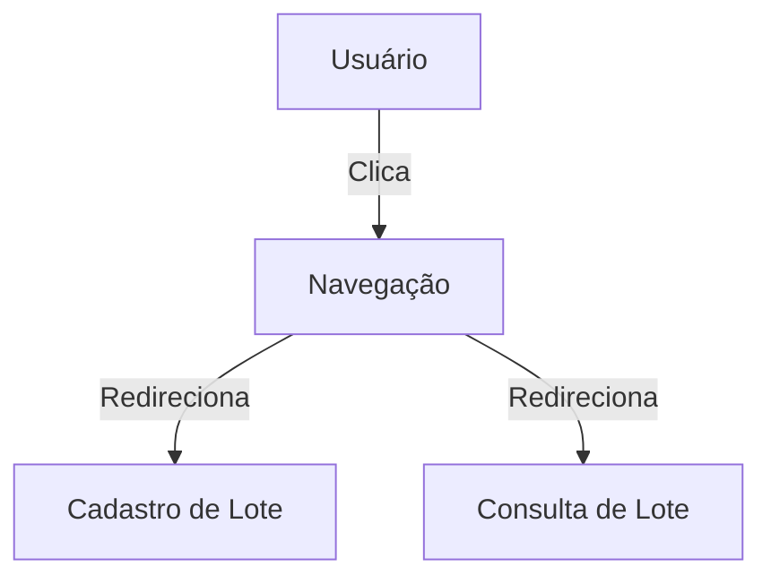

<details>
<summary>Relevant source files</summary>

- [src/pages/Index.tsx](https://github.com/guilhermedreis/tecido-lote-gestor/blob/main/src/pages/Index.tsx)
</details>

# Componentes da Página Inicial

A página inicial do projeto *tecido-lote-gestor* é um componente central que fornece uma interface amigável para gerenciamento de lotes de tecido. Esta página serve como o ponto de entrada para os usuários, permitindo acesso a funcionalidades como cadastro, consulta e acompanhamento de lotes. Utilizando React e Tailwind CSS, a página é construída de forma a ser responsiva e visualmente atraente.

## Estrutura da Página

### Composição da Página Inicial

A estrutura da página inicial é composta por diversos componentes que são organizados para proporcionar uma experiência de usuário fluida. Os principais componentes incluem:

- **Navegação:** Um componente de navegação que permite ao usuário acessar diferentes partes do sistema.
- **Cartões de Ação:** Cartões que contêm botões para ações como cadastrar novos lotes, consultar lotes e acompanhar lotes.

```tsx
// src/pages/Index.tsx
import Navigation from '@/components/Navigation';
import { Card, CardContent } from '@/components/ui/card';
import { Button } from '@/components/ui/button';

const Index = () => {
  return (
    <div className="min-h-screen bg-blue-50">
      <Navigation />
      <div className="max-w-7xl mx-auto p-4 sm:p-6">
        {/* Cartões de Ação */}
        <Card>
          <CardContent>
            <Button>Cadastrar Lote</Button>
          </CardContent>
        </Card>
      </div>
    </div>
  );
};
```

## Funcionalidades

### Navegação

O componente de navegação é responsável por fornecer links para diferentes seções do aplicativo, permitindo que os usuários naveguem facilmente entre funcionalidades. Ele utiliza o componente `Link` do React Router para gerenciar as rotas.

```tsx
// src/pages/Index.tsx
import { Link } from 'react-router-dom';

<Navigation>
  <Link to="/cadastro">Cadastrar Lote</Link>
  <Link to="/consulta">Consultar Lote</Link>
</Navigation>
```

### Cartões de Ação

Os cartões de ação são utilizados para destacar as principais funcionalidades da página inicial. Cada cartão possui um título, uma descrição e um botão que leva o usuário à funcionalidade correspondente.

```tsx
// src/pages/Index.tsx
<Card>
  <CardContent>
    <h2>Cadastrar Novo Lote</h2>
    <Button onClick={navigateToCadastro}>Cadastrar</Button>
  </CardContent>
</Card>
```

### Estilização

A estilização da página é realizada utilizando Tailwind CSS, permitindo que os componentes sejam responsivos e visualmente consistentes. Cada componente recebe classes CSS que definem seu estilo e layout.

## Fluxo de Dados

O fluxo de dados na página inicial é simples, com interação direta entre o usuário e os componentes. Quando um usuário clica em um botão, o estado da aplicação é atualizado, e o usuário é redirecionado para a página correspondente.



## Tabela de Componentes

| Componente          | Descrição                                            |
|---------------------|-----------------------------------------------------|
| `Navigation`        | Componente de navegação para acessar outras páginas. |
| `Card`              | Componente que encapsula informações e ações.       |
| `Button`            | Componente de botão para ações de usuário.          |

## Conclusão

A página inicial do *tecido-lote-gestor* serve como um ponto de partida crucial para o gerenciamento de lotes. Com uma estrutura bem definida e componentes reutilizáveis, a interface proporciona uma experiência de usuário intuitiva e eficiente. As funcionalidades de navegação e interação são implementadas de forma a facilitar o acesso às principais tarefas do sistema.