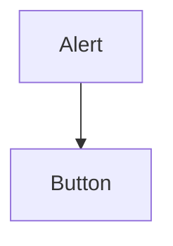

<details>
<summary>Relevant source files</summary>

- [src/components/ui/alert.tsx](https://github.com/guilhermedreis/tecido-lote-gestor/blob/main/src/components/ui/alert.tsx)
- [src/components/ui/button.tsx](https://github.com/guilhermedreis/tecido-lote-gestor/blob/main/src/components/ui/button.tsx)
</details>

# Componentes de UI Reutilizáveis

Os componentes de UI reutilizáveis no projeto "tecido-lote-gestor" são elementos fundamentais que garantem consistência e eficiência na construção da interface do usuário. Construídos com React, TypeScript e Tailwind CSS, esses componentes visam facilitar a manutenção e a escalabilidade da aplicação, promovendo uma experiência de usuário coesa.

## Estrutura dos Componentes

### Componente Alert

O componente `Alert` é utilizado para exibir mensagens informativas ao usuário, como notificações de sucesso ou erro. Ele suporta diferentes variantes de estilo, permitindo adaptações conforme a necessidade.

```tsx
// src/components/ui/alert.tsx
const alertVariants = cva(
  "relative w-full rounded-lg border p-4 [&>svg~*]:pl-7 [&>svg+div]:translate-y-[-3px] [&>svg]:absolute [&>svg]:left-4 [&>svg]:top-4 [&>svg]:text-foreground",
  {
    variants: {
      variant: {
        default: "bg-background text-foreground",
        destructive:
          "border-destructive/50 text-destructive dark:border-destructive [&>svg]:text-destructive",
      },
    },
  }
)
```

### Componente Button

O componente `Button` é um elemento interativo que permite ações do usuário, como enviar formulários ou navegar entre páginas. Ele é configurável para diferentes variantes e tamanhos.

```tsx
// src/components/ui/button.tsx
const Button = React.forwardRef<
  HTMLButtonElement,
  React.ButtonHTMLAttributes<HTMLButtonElement> & VariantProps<typeof buttonVariants>
>(({ className, variant, size, ...props }, ref) => (
  <button
    ref={ref}
    className={cn(buttonVariants({ variant, size }), className)}
    {...props}
  />
))
Button.displayName = "Button"
```

## Fluxo de Dados e Interações

Os componentes de UI interagem entre si e com o restante da aplicação, facilitando a criação de interfaces ricas e dinâmicas. O diagrama abaixo ilustra as relações entre os componentes principais:



O componente `Alert` pode ser utilizado em conjunto com o `Button` para fornecer feedback ao usuário após ações como a submissão de formulários.

## Tabela de Componentes

| Componente | Descrição |
|------------|-----------|
| Alert      | Exibe mensagens informativas ao usuário. |
| Button     | Elemento interativo para ações do usuário. |

## Conclusão

Os componentes de UI reutilizáveis são essenciais para a construção de interfaces eficientes e coesas no "tecido-lote-gestor". Através da utilização de componentes como `Alert` e `Button`, o projeto não só melhora a experiência do usuário, mas também garante uma base sólida para futuras expansões e manutenções.