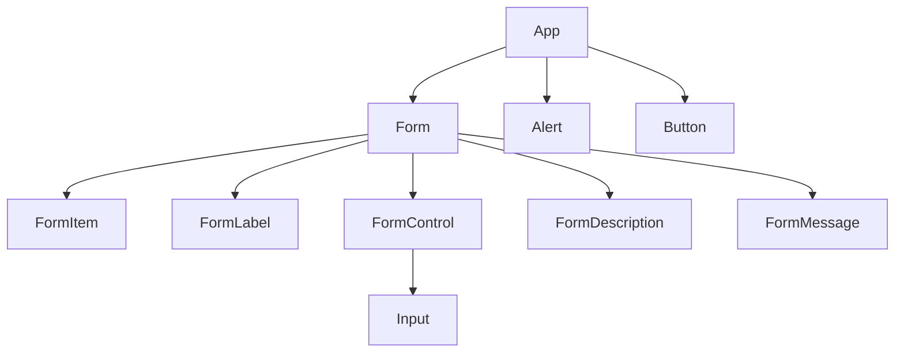

<details>
<summary>Relevant source files</summary>

The following files were used as context to generate this wiki page:

- [src/components/ui/alert.tsx](https://github.com/GuilhermeDReis/tecido-lote-gestor/blob/main/src/components/ui/alert.tsx)
- [src/components/ui/button.tsx](https://github.com/GuilhermeDReis/tecido-lote-gestor/blob/main/src/components/ui/button.tsx)
- [src/components/ui/form.tsx](https://github.com/GuilhermeDReis/tecido-lote-gestor/blob/main/src/components/ui/form.tsx)
- [src/components/ui/input.tsx](https://github.com/GuilhermeDReis/tecido-lote-gestor/blob/main/src/components/ui/input.tsx)
</details>

# Components

This document provides a technical overview of reusable UI components within the project. These components leverage the `shadcn-ui` library and are built using React, TypeScript, and Tailwind CSS.  They are designed to ensure consistency and maintainability across the application's user interface.

## Form Components

Form components provide structured input and validation functionality.

### Form Structure and Validation

The `Form` component and its related sub-components (`FormItem`, `FormLabel`, `FormControl`, `FormDescription`, `FormMessage`, and `FormField`) manage form structure, input handling, and error display.

```tsx
// src/components/ui/form.tsx
const Form = React.forwardRef<
  HTMLFormElement,
  React.FormHTMLAttributes<HTMLFormElement>
>(({ className, ...props }, ref) => (
  <form
    ref={ref}
    className={cn(
      "grid gap-6",
      className
    )}
    {...props}
  />
))
Form.displayName = "Form"
```

The `useFormField` hook provides error handling and message display capabilities.

```tsx
// src/components/ui/form.tsx
const FormMessage = React.forwardRef<
  HTMLParagraphElement,
  React.HTMLAttributes<HTMLParagraphElement>
>(({ className, children, ...props }, ref) => {
  const { error, formMessageId } = useFormField()
  // ...
})

```

### Input

The `Input` component handles basic text input.

```tsx
// src/components/ui/input.tsx
const Input = React.forwardRef<
  HTMLInputElement,
  React.InputHTMLAttributes<HTMLInputElement>
>(({ className, ...props }, ref) => (
  <input
    ref={ref}
    className={cn(
      "flex h-10 w-full rounded-md border border-input bg-background px-3 py-2 text-sm ring-offset-background file:border-0 file:bg-transparent file:text-sm file:font-medium placeholder:text-muted-foreground focus-visible:outline-none focus-visible:ring-2 focus-visible:ring-ring focus-visible:ring-offset-2 disabled:cursor-not-allowed disabled:opacity-50",
      className
    )}
    {...props}
  />
))
Input.displayName = "Input"

```


## Alert Component

The `Alert` component displays informative messages to the user.  It supports different variants for visual styling.

```tsx
// src/components/ui/alert.tsx
const alertVariants = cva(
  "relative w-full rounded-lg border p-4 [&>svg~*]:pl-7 [&>svg+div]:translate-y-[-3px] [&>svg]:absolute [&>svg]:left-4 [&>svg]:top-4 [&>svg]:text-foreground",
  {
    variants: {
      variant: {
        default: "bg-background text-foreground",
        destructive:
          "border-destructive/50 text-destructive dark:border-destructive [&>svg]:text-destructive",
      },
    },
    // ...
  }
)
```

## Button Component

The `Button` component provides interactive elements for user actions.

```tsx
// src/components/ui/button.tsx
const Button = React.forwardRef<
  HTMLButtonElement,
  React.ButtonHTMLAttributes<HTMLButtonElement> & VariantProps<typeof buttonVariants>
>(({ className, variant, size, ...props }, ref) => (
  <button
    ref={ref}
    className={cn(buttonVariants({ variant, size }), className)}
    {...props}
  />
))
Button.displayName = "Button"
```

## Component Relationships




This diagram illustrates the relationships between the form components and other UI elements. The `Form` component acts as a container for other form-related components, while `Alert` and `Button` are independent components used within the application.
