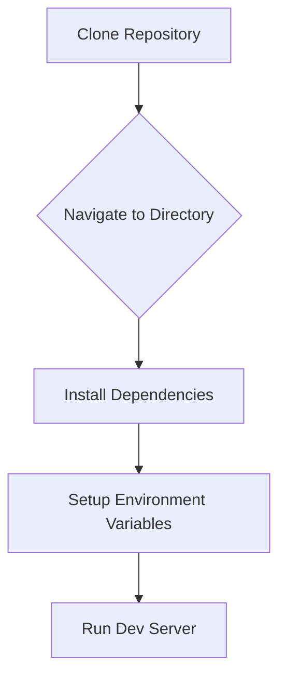

<details>
<summary>Relevant source files</summary>

The following files were used as context to generate this wiki page:

- [README.md](https://github.com/GuilhermeDReis/tecido-lote-gestor/blob/main/README.md)
</details>

# Deployment

This wiki page details the deployment process for the *tecido-lote-gestor* application.  The application is designed to manage fabric batches, including tracking client information, batch details, and generating reports.  Deployment information is limited, focusing on local development setup.

## Local Development Setup

The primary deployment documentation focuses on setting up the project for local development. This involves installing dependencies, configuring environment variables, and running the application locally.

### Prerequisites

The project requires Node.js and npm (or yarn) to be installed on the development machine.

### Installation Steps

1. **Clone the repository:**
   ```bash
   git clone https://github.com/GuilhermeDReis/tecido-lote-gestor.git
   ```

2. **Navigate to the project directory:**
   ```bash
   cd tecido-lote-gestor
   ```

3. **Install dependencies:**
   ```bash
   npm install
   ```
   or
   ```bash
   yarn install
   ```

4. **Set up environment variables:**
    The project uses environment variables, particularly for the Supabase integration.  These are typically stored in a `.env` file in the root directory.  The specific variables needed are not detailed in the available documentation.


5. **Run the development server:**
   ```bash
   npm run dev
   ```
   or
   ```bash
   yarn dev
   ```

This starts the development server, typically accessible at `http://localhost:5173`.

### Development Workflow

The `README` mentions the use of technologies like Next.js, TypeScript, Tailwind CSS, and Prisma. These suggest a standard workflow of editing source files and relying on the development server to automatically reload changes.


## Production Deployment (Not Documented)

The provided documentation does not include instructions for deploying the *tecido-lote-gestor* application to a production environment.  Details regarding server configuration, database setup, and deployment steps are absent.




## Future Considerations for Documentation

To improve the deployment documentation, the following information should be added:

* **Detailed production deployment instructions:** This should include target environments (e.g., Vercel, Netlify, Heroku), specific build steps, database setup, and server configuration.
* **Environment variables:** A comprehensive list of required environment variables and their purpose.
* **Troubleshooting common deployment issues:**  This could include solutions to common errors encountered during setup and deployment.

This additional information will significantly enhance the usability of the project and facilitate deployment to various environments.
