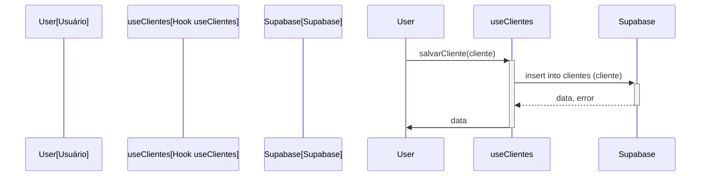

<details>
<summary>Relevant source files</summary>

- [docsteste/data_management.md](https://github.com/guilhermedreis/tecido-lote-gestor/blob/main/docsteste/data_management.md)
</details>

# Diagrama de Fluxo de Dados

O "Diagrama de Fluxo de Dados" serve para ilustrar como os dados fluem dentro da aplicação "tecido-lote-gestor", especialmente no gerenciamento de clientes e lotes. Este diagrama ajuda a entender as interações entre o frontend e o backend, bem como as operações de manipulação de dados realizadas pela aplicação.

## Arquitetura do Sistema

A arquitetura da aplicação é dividida em duas partes principais: o frontend, que é responsável pela interface do usuário, e o backend, que gerencia a lógica de negócios e o armazenamento de dados.

### Frontend (React)

O frontend é construído usando React e gerencia a interação do usuário e a apresentação de dados. Ele se comunica com o backend através de hooks personalizados que abstraem a lógica de acesso aos dados.

### Backend (Supabase)

O Supabase fornece os serviços de backend, incluindo o gerenciamento do banco de dados e autenticação. Os dados são organizados em tabelas que armazenam informações sobre clientes e lotes.

```mermaid
graph TD
    User[Usuário] --> Frontend[Frontend (React)]
    Frontend --> Supabase[Supabase (Backend)]
    Supabase --> Database[Banco de Dados (PostgreSQL)]
```

## Fluxo de Dados

O fluxo de dados é gerenciado através de hooks personalizados que encapsulam a lógica de interação com o Supabase.

### Hook `useClientes`

O hook `useClientes` gerencia todas as interações relacionadas a dados de clientes. 

#### Funcionalidades

| Função                | Descrição                                                        |
|----------------------|------------------------------------------------------------------|
| `salvarCliente`      | Salva um novo cliente na tabela `clientes`.                      |
| `atualizarCliente`   | Atualiza um cliente existente na tabela `clientes`.              |
| `excluirCliente`     | Exclui um cliente da tabela `clientes`.                          |
| `buscarClientes`     | Busca clientes baseado em um termo de pesquisa.                 |

#### Exemplo: Salvando um Cliente

```typescript
const salvarCliente = async (cliente: Cliente) => {
  try {
    const { data, error } = await supabase
      .from('clientes')
      .insert([cliente])
      .select()
      .single();

    if (error) {
      throw error;
    }

    setClientes(prev => [...prev, data].sort((a, b) => a.nome.localeCompare(b.nome)));
    
    return data;
  } catch (error) {
    // Tratamento de erro
  }
};
```

### Hook `useLotes`

O hook `useLotes` gerencia as interações relacionadas aos dados de lotes.

#### Funcionalidades

| Função                 | Descrição                                                       |
|-----------------------|---------------------------------------------------------------|
| `salvarLote`          | Salva um novo lote na tabela `lotes`.                          |
| `buscarLotePorCodigo` | Recupera um lote pelo seu código.                              |
| `carregarLotes`       | Carrega todos os lotes da tabela `lotes`.                     |

#### Exemplo: Buscando um Lote

```typescript
const buscarLotePorCodigo = async (codigo: string): Promise<Lote | null> => {
  const { data, error } = await supabase
    .from('lotes')
    .select('*')
    .eq('codigo_lote', codigo)
    .maybeSingle();

  if (error) {
    throw error;
  }

  return data;
};
```

## Diagrama de Sequência

O diagrama de sequência abaixo ilustra o processo de salvar um cliente na aplicação.



## Conclusão

O diagrama de fluxo de dados fornece uma visão clara de como os dados são gerenciados na aplicação "tecido-lote-gestor". A utilização de hooks personalizados para interagir com o Supabase permite que a aplicação mantenha uma estrutura organizada e eficiente para o gerenciamento de clientes e lotes, facilitando a manutenção e a escalabilidade do sistema.