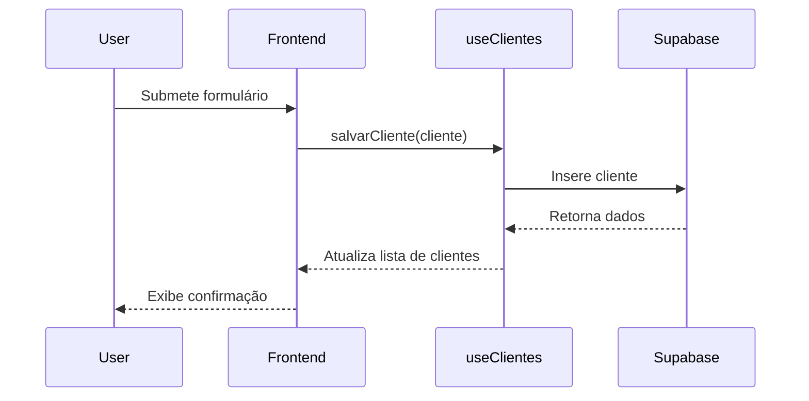

<details>
<summary>Relevant source files</summary>

- [docsteste/getting_started.md](https://github.com/guilhermedreis/tecido-lote-gestor/blob/main/docsteste/getting_started.md)
- [docsteste/overview.md](https://github.com/guilhermedreis/tecido-lote-gestor/blob/main/docsteste/overview.md)
- [docsteste/data_management.md](https://github.com/guilhermedreis/tecido-lote-gestor/blob/main/docsteste/data_management.md)
</details>

# Extensibilidade e Personalização do Projeto

A extensibilidade e personalização do projeto "tecido-lote-gestor" são aspectos fundamentais que permitem que desenvolvedores e usuários adaptem a aplicação às suas necessidades específicas. Este projeto é uma aplicação web destinada ao gerenciamento de lotes de tecido, utilizando tecnologias modernas como React, TypeScript e Supabase, facilitando a personalização de sua estrutura e funcionalidades.

## Estrutura do Projeto

### Arquitetura Geral

A arquitetura do projeto segue um padrão cliente-servidor, onde o frontend é construído com React e se comunica com o backend fornecido pelo Supabase. Isso permite que a aplicação seja modular e extensível, permitindo que novos componentes e funcionalidades sejam adicionados facilmente.

```mermaid
graph TD
    User[Usuário] --> Frontend[Frontend (React)]
    Frontend --> Supabase[Backend (Supabase)]
    Supabase --> Database[Banco de Dados (PostgreSQL)]
```

### Componentes Principais

Os principais componentes que compõem a aplicação incluem:

| Componente             | Descrição                                                                                       |
|-----------------------|-------------------------------------------------------------------------------------------------|
| Frontend              | Responsável pela interface do usuário e pela interação com o backend.                         |
| Supabase              | Fornece serviços de backend, incluindo autenticação e armazenamento de dados.                  |
| Hooks Personalizados   | Facilita a interação com a API do Supabase, permitindo a manipulação de dados de forma simples.|

## Personalização de Componentes

### Hooks Personalizados

Os hooks personalizados são uma forma eficiente de encapsular a lógica de negócios e facilitar a reutilização de código. Por exemplo, o hook `useClientes` gerencia todas as interações relacionadas a clientes, permitindo operações como salvar, atualizar e excluir clientes.

#### Exemplo de `useClientes`

```typescript
// src/hooks/useClientes.ts

const salvarCliente = async (cliente: Cliente) => {
  try {
    const { data, error } = await supabase
      .from('clientes')
      .insert([cliente])
      .select()
      .single();

    if (error) {
      throw error;
    }

    setClientes(prev => [...prev, data]);
  } catch (error) {
    // Tratamento de erro
  }
};
```

### Estrutura de Dados

A estrutura de dados utilizada no projeto é baseada em tabelas no Supabase, onde cada tabela representa um modelo de dados específico. Por exemplo, a tabela de `clientes` contém campos como `nome`, `codigo` e `observacao`.

```typescript
// src/integrations/supabase/types.ts
export type Cliente = {
  id: string;
  nome: string;
  codigo: string;
  observacao?: string;
};
```

## Fluxo de Dados

### Interação do Usuário

O fluxo de dados na aplicação começa com a interação do usuário no frontend, que aciona chamadas para os hooks personalizados. Esses hooks, por sua vez, interagem com o Supabase para realizar operações de CRUD (Criar, Ler, Atualizar, Excluir).



## Conclusão

A extensibilidade e personalização do projeto "tecido-lote-gestor" são facilitadas por sua arquitetura modular e pelo uso de hooks personalizados. Isso não apenas permite uma fácil adaptação às necessidades dos usuários, mas também promove a reutilização de código e a manutenção eficiente da aplicação. A implementação de um sistema de gerenciamento de dados robusto, combinado com uma interface amigável, torna este projeto uma solução eficaz para o gerenciamento de lotes de tecido.