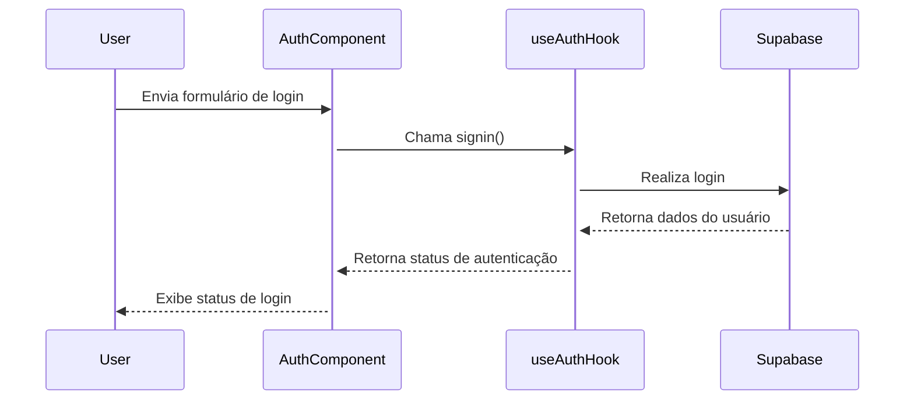

<details>
<summary>Relevant source files</summary>

- [docsteste/overview.md](https://github.com/guilhermedreis/tecido-lote-gestor/blob/main/docsteste/overview.md)
</details>

# Funcionalidades do Aplicativo

O aplicativo "tecido-lote-gestor" foi desenvolvido para gerenciar lotes de tecido, permitindo que os usuários registrem, atualizem, pesquisem e excluam informações sobre lotes e clientes. Utilizando tecnologias modernas como React, TypeScript e Supabase, o sistema proporciona uma interface amigável e eficiente para a gestão de dados.

## Arquitetura do Aplicativo

A arquitetura do aplicativo segue um padrão cliente-servidor, com um frontend em React e um backend fornecido pelo Supabase. O fluxo de dados é centralizado, onde o frontend interage com o backend para operações de CRUD (criação, leitura, atualização e exclusão).

```mermaid
graph TD
    User[Usuário] --> Frontend[Frontend (React)]
    Frontend --> Supabase[Supabase (Backend)]
    Supabase --> Database[Banco de Dados (PostgreSQL)]
```

## Funcionalidades Principais

### Gestão de Clientes

A gestão de clientes é uma parte essencial do aplicativo. Através do hook `useClientes`, os usuários podem realizar operações sobre os dados dos clientes.

#### Funcionalidades do `useClientes`

| Função                   | Descrição                                                        |
|-------------------------|------------------------------------------------------------------|
| `salvarCliente(cliente)` | Salva um novo cliente na tabela `clientes`.                      |
| `atualizarCliente(id)`  | Atualiza um cliente existente na tabela `clientes`.              |
| `excluirCliente(id)`    | Exclui um cliente da tabela `clientes`.                          |
| `buscarClientes(termo)` | Busca clientes com base em um termo de pesquisa.                |

Exemplo de implementação da função `salvarCliente`:

```typescript
// src/hooks/useClientes.ts
const salvarCliente = async (cliente: Cliente) => {
  const { data, error } = await supabase
    .from('clientes')
    .insert([cliente])
    .single();
  
  if (error) {
    throw error;
  }
  return data;
};
```

### Gestão de Lotes

A gestão de lotes permite que os usuários acompanhem os detalhes dos lotes de tecido, incluindo informações como gramatura, fio e cor. Através do hook `useLotes`, os usuários podem manipular dados relacionados aos lotes.

#### Funcionalidades do `useLotes`

| Função                     | Descrição                                                    |
|---------------------------|-------------------------------------------------------------|
| `salvarLote(lote)`        | Salva um novo lote na tabela `lotes`.                       |
| `buscarLotePorCodigo(codigo)` | Recupera um lote pelo seu código.                      |
| `carregarLotes()`         | Carrega todos os lotes disponíveis.                         |

Exemplo de implementação da função `salvarLote`:

```typescript
// src/hooks/useLotes.ts
const salvarLote = async (lote: Lote) => {
  const { data, error } = await supabase
    .from('lotes')
    .insert([lote])
    .single();
  
  if (error) {
    throw error;
  }
  return data;
};
```

## Autenticação de Usuários

O sistema de autenticação é gerenciado pelo hook `useAuth`, que utiliza o Supabase para autenticar usuários.

### Fluxo de Autenticação



O `useAuth` fornece funções como `signin` e `signup`, permitindo que os usuários façam login e se cadastrem facilmente.

## Conclusão

O "tecido-lote-gestor" oferece um conjunto robusto de funcionalidades para a gestão de lotes de tecido, com um foco particular na usabilidade e na eficiência do gerenciamento de dados. Com uma arquitetura bem definida e um fluxo de dados claro, o aplicativo é capaz de suportar operações complexas de maneira intuitiva, garantindo uma experiência do usuário satisfatória.