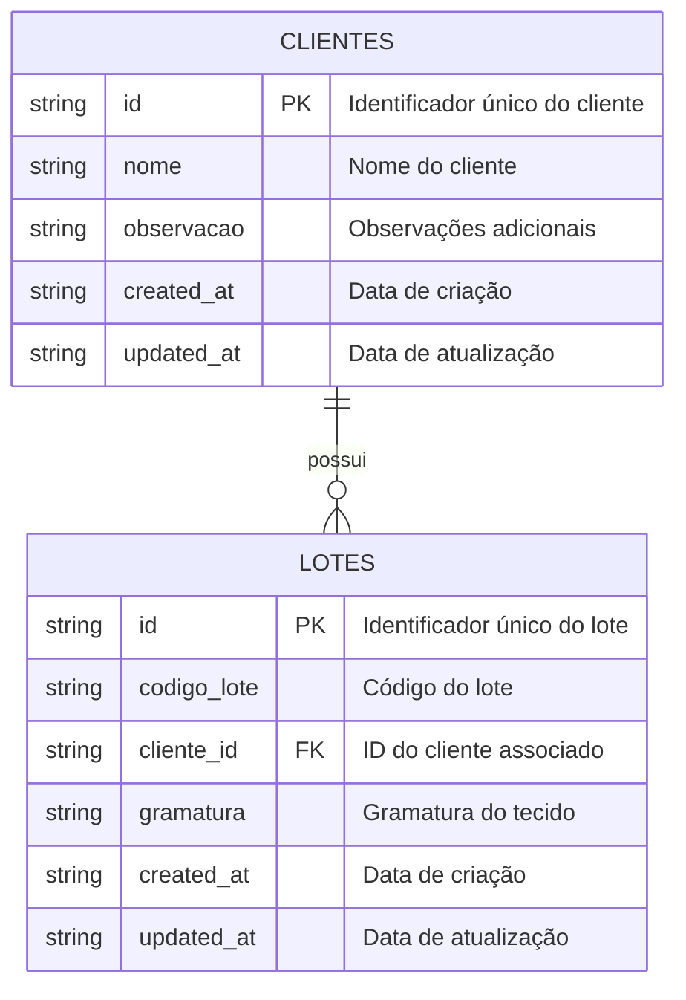
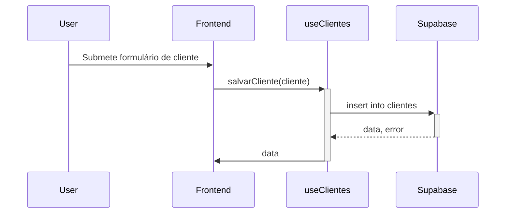

<details>
<summary>Relevant source files</summary>

- [src/integrations/supabase/types.ts](https://github.com/guilhermedreis/tecido-lote-gestor/blob/main/src/integrations/supabase/types.ts)
</details>

# Integração com Modelos de Dados

A integração com modelos de dados no projeto *tecido-lote-gestor* é fundamental para a gestão eficiente de informações sobre clientes e lotes de tecido. Esta seção detalha como os dados são estruturados, manipulados e integrados com o backend utilizando o Supabase, que atua como o banco de dados e serviço de autenticação da aplicação.

## Estrutura de Dados

### Entidades Principais

O sistema gerencia duas entidades principais: **clientes** e **lotes**. Cada entidade possui um conjunto de atributos que descrevem suas características.

#### Tabela de Clientes

| Campo        | Tipo         | Descrição                                |
|--------------|--------------|------------------------------------------|
| `id`         | string       | Identificador único do cliente.          |
| `nome`       | string       | Nome do cliente.                         |
| `observacao` | string|null  | Observações adicionais sobre o cliente.  |
| `created_at` | string       | Data de criação do registro.             |
| `updated_at` | string       | Data da última atualização do registro.  |

#### Tabela de Lotes

| Campo                    | Tipo         | Descrição                                      |
|--------------------------|--------------|------------------------------------------------|
| `id`                     | string       | Identificador único do lote.                   |
| `codigo_lote`           | string       | Código identificador do lote.                  |
| `cliente_id`            | string|null  | ID do cliente associado ao lote.               |
| `gramatura`             | string|null  | Gramatura do tecido.                           |
| `created_at`            | string       | Data de criação do registro.                   |
| `updated_at`            | string       | Data da última atualização do registro.        |

### Diagrama de Entidade-Relacionamento

O diagrama a seguir ilustra a relação entre as entidades **clientes** e **lotes**.



## Interação com o Supabase

### Configuração do Cliente Supabase

O cliente Supabase é inicializado com a URL e a chave pública do projeto. Este cliente permite que a aplicação interaja com o banco de dados para operações de CRUD (Criar, Ler, Atualizar, Excluir).

```typescript
// src/integrations/supabase/client.ts

import { createClient } from '@supabase/supabase-js';
import type { Database } from './types';

const SUPABASE_URL = "https://mucfueexayxqogwgtmvv.supabase.co";
const SUPABASE_PUBLISHABLE_KEY = "sua-chave-publica";

export const supabase = createClient<Database>(SUPABASE_URL, SUPABASE_PUBLISHABLE_KEY);
```

### Hooks Personalizados

Os hooks personalizados `useClientes` e `useLotes` encapsulam a lógica de interação com o Supabase, simplificando as operações de manipulação de dados.

#### Hook `useClientes`

Este hook gerencia as operações relacionadas aos clientes.

```typescript
// src/hooks/useClientes.ts

const salvarCliente = async (cliente: Cliente) => {
  const { data, error } = await supabase
    .from('clientes')
    .insert([cliente])
    .single();

  if (error) {
    throw error;
  }

  return data;
};
```

#### Hook `useLotes`

Este hook gerencia as operações relacionadas aos lotes.

```typescript
// src/hooks/useLotes.ts

const buscarLotePorCodigo = async (codigo: string): Promise<Lote | null> => {
  const { data, error } = await supabase
    .from('lotes')
    .select('*')
    .eq('codigo_lote', codigo)
    .maybeSingle();

  if (error) {
    throw error;
  }

  return data;
};
```

## Fluxo de Dados

O fluxo de dados entre o frontend e o Supabase é essencial para a operação do sistema. O diagrama a seguir ilustra a sequência de interações durante a criação de um novo cliente.



## Conclusão

A integração com modelos de dados no *tecido-lote-gestor* permite uma gestão eficiente e organizada de informações sobre clientes e lotes. A utilização do Supabase como backend facilita a implementação de operações de CRUD, enquanto a estrutura de dados bem definida garante que as informações sejam mantidas de forma coerente e acessível. Essa abordagem escalável e modular é essencial para o crescimento futuro da aplicação.