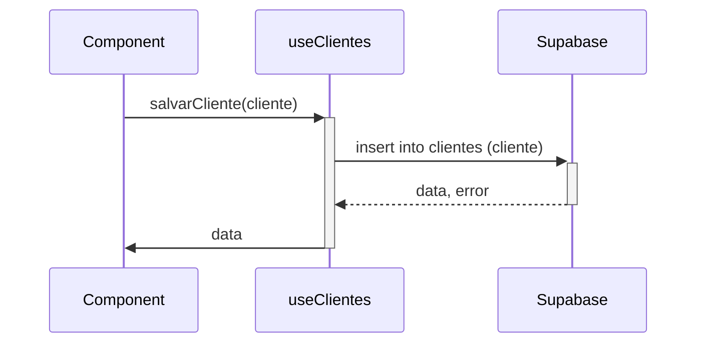

<details>
<summary>Relevant source files</summary>

- [README.md](https://github.com/guilhermedreis/tecido-lote-gestor/blob/main/README.md)
</details>

# Introdução ao Tecido Lote Gestor

O *Tecido Lote Gestor* é uma aplicação web desenvolvida para gerenciar lotes de tecido, permitindo o registro, atualização, busca e exclusão de informações relacionadas a lotes de tecido e clientes. A aplicação é construída utilizando tecnologias modernas como React, TypeScript e Supabase, proporcionando uma interface amigável e responsiva para o usuário.

## Arquitetura do Sistema

A arquitetura do *Tecido Lote Gestor* é baseada em uma estrutura cliente-servidor, onde o frontend comunica-se com o backend via API. O Supabase atua como o backend, fornecendo serviços de autenticação e armazenamento de dados.

```mermaid
graph TD
    User[Usuário] --> Frontend[Frontend (React)]
    Frontend --> Supabase[Supabase (Backend)]
    Supabase --> Database[Banco de Dados PostgreSQL]
```

### Frontend

O frontend é responsável pela interação do usuário e apresentação dos dados. Utiliza a biblioteca Radix UI para componentes de interface e Tailwind CSS para estilização. A estrutura é baseada em componentes reutilizáveis, facilitando a manutenção e a escalabilidade.

### Backend

O Supabase fornece serviços de banco de dados, autenticação e API. Ele armazena informações em tabelas, como `clientes` e `lotes`, permitindo operações CRUD (Criar, Ler, Atualizar, Excluir).

## Fluxo de Dados

O fluxo de dados na aplicação é gerenciado através de hooks personalizados que interagem com a API do Supabase. Os principais hooks utilizados incluem `useClientes` e `useLotes`, que encapsulam a lógica de acesso e manipulação de dados.



### Exemplo de Hook: useClientes

O hook `useClientes` gerencia todas as interações relacionadas aos dados dos clientes, incluindo funções para salvar, atualizar, excluir e buscar clientes.

```typescript
// src/hooks/useClientes.ts
const salvarCliente = async (cliente: Cliente) => {
  try {
    const { data, error } = await supabase
      .from('clientes')
      .insert([cliente])
      .select()
      .single();

    if (error) throw error;

    return data;
  } catch (error: any) {
    // Tratamento de erro
  }
};
```

### Exemplo de Hook: useLotes

Similar ao `useClientes`, o `useLotes` gerencia as interações relacionadas aos lotes de tecido.

```typescript
// src/hooks/useLotes.ts
const salvarLote = async (lote: Lote) => {
  try {
    const { data, error } = await supabase
      .from('lotes')
      .insert([lote])
      .select()
      .single();

    if (error) throw error;

    return data;
  } catch (error: any) {
    // Tratamento de erro
  }
};
```

## Componentes do Sistema

A aplicação é composta por diversos componentes que facilitam a interação do usuário. Alguns dos principais componentes incluem:

| Componente         | Descrição                                          |
|--------------------|---------------------------------------------------|
| `CadastroClientes`  | Formulário para cadastro e edição de clientes.    |
| `CadastroLote`     | Formulário para cadastro de novos lotes.          |
| `Auth`             | Componente de autenticação para login e registro.  |

## Conclusão

O *Tecido Lote Gestor* é uma solução robusta e moderna para o gerenciamento de lotes de tecido, aproveitando as capacidades do React e Supabase. A estrutura modular e o uso de hooks personalizados tornam a aplicação fácil de manter e expandir, possibilitando futuras melhorias e integrações.