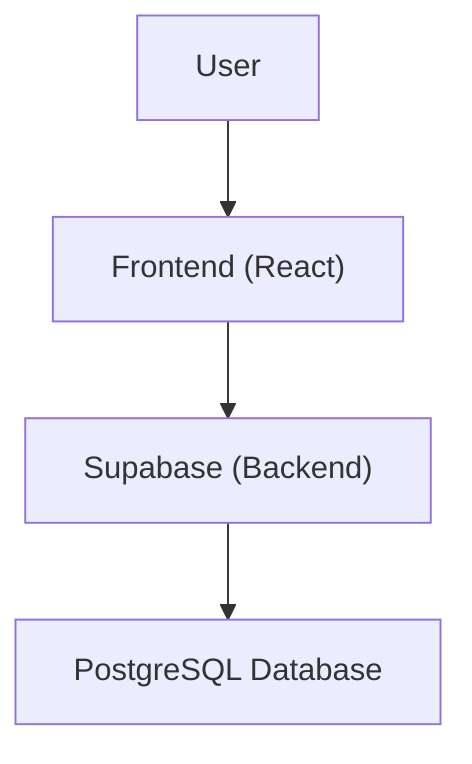

<details>
<summary>Relevant source files</summary>

The following files were used as context to generate this wiki page:

- [README.md](https://github.com/GuilhermeDReis/tecido-lote-gestor/blob/main/README.md)
</details>

# Overview

This wiki page provides a high-level overview of the "tecido-lote-gestor" project, a web application for managing fabric batches (lotes).  It allows users to register, update, search, and delete fabric batch information, including details like the client, roll length, and storage location.  The application is built using React, TypeScript, and Supabase.

## Architecture

The application follows a standard client-server architecture:

### Frontend (React/TypeScript)

The frontend is responsible for user interaction, data presentation, and communicating with the backend via the Supabase client library.  It uses a component-based structure, leveraging UI libraries like Radix UI and Shadcn/ui for pre-built components.

### Backend (Supabase)

Supabase provides the backend services, including database hosting, authentication, and API endpoints.  The database schema includes tables for clients, batches, and user profiles.

## Data Flow



The user interacts with the React frontend.  The frontend communicates with the Supabase backend for data retrieval, modification, and authentication. Supabase interacts with the underlying PostgreSQL database.

## Key Components and Functionality

| Component/Feature | Description |
|---|---|
| Client Management | Allows users to create, update, and delete client information. |
| Batch Management | Enables management of fabric batch details, including linking to clients. |
| Search | Provides search functionality to find specific batches based on criteria. |
| Authentication | Uses Supabase authentication for secure user access. |

## Code Example (Client Creation)

While the provided source files don't include a complete example of client creation, the `useClientes` hook suggests the structure:

```typescript
// src/hooks/useClientes.ts (excerpt)
const criarCliente = async (cliente: Cliente) => {
  // ... Supabase client call to insert client data ...
};
```

## Future Enhancements (Based on README)

The README mentions potential future features:

-   Improved search functionality.
-   Reporting and analytics.
-   Integration with other systems.


## Conclusion

The "tecido-lote-gestor" application provides a streamlined solution for managing fabric batches.  Its use of React, TypeScript, and Supabase offers a modern and scalable foundation for future development.  The potential future enhancements outlined in the README suggest a roadmap for increased functionality and integration.
