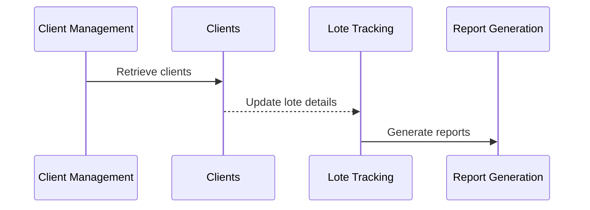

<details>
<summary>Relevant source files</summary>

- [src/pages/ConsultaClientes.tsx](https://github.com/GuilhermeDReis/tecido-lote-gestor/blob/main/src/pages/ConsultaClientes.tsx)
- [src/components/ui/alert.tsx](https://github.com/GuilhermeDReis/tecido-lote-gestor/blob/main/src/components/ui/alert.tsx)
- [src/pages/Index.tsx](https://github.com/GuilhermeDReis/tecido-lote-gestor/blob/main/src/pages/Index.tsx)
- [src/components/ui/select.tsx](https://github.com/GuilhermeDReis/tecido-lote-gestor/blob/main/src/components/ui/select.tsx)
- [src/pages/ConsultaLote.tsx](https://github.com/GuilhermeDReis/tecido-lote-gestor/blob/main/src/pages/ConsultaLote.tsx)
- [src/hooks/useClientes.ts](https://github.com/GuilhermeDReis/tecido-lote-gestor/blob/main/src/hooks/useClientes.ts)
</details>

# Process Workflows

## Introduction
Process Workflows is a core module in the Tecido Lote Gestor project, responsible for managing client information and lote data. This section will provide an overview of how the module operates within the larger context of the software.

### Key Components & Data Flow
- **Clients**:
  - The module maintains a list of clients with their details (name, code, etc.) to be used in various workflows.
  
- **Lotes**:
  - Tracks and manages information about different lotes, including gramatura, fio, color, etc., which can be used for multiple purposes such as printing reports or tracking inventory.

### Detailed Sections

#### Client Management
##### Data Structure & Logic
The `clients` section is responsible for maintaining a list of clients with their details. It uses an array to store client objects containing various properties like name, code, and additional information.
```typescript
interface Cliente {
  id: string;
  nome: string | null;
  codigo_lote: string | null;
  // ... other relevant fields ...
}
```
In `src/components/ui/select.tsx`, the data structure is used to select clients for various actions:
```typescript
export const Select = React.forwardRef<
  HTMLDivElement,
  React.HTMLAttributes<HTMLDivElement> & VariantProps<typeof alertVariants>
>(({ className, variant, ...props }, ref) => (
  <div
    ref={ref}
    role="alert"
    className={cn(alertVariants({ variant }), className)}
    {...props}
  />
))
```
The `clients` data structure is updated in the `CadastroClientes.tsx` component when new clients are added or existing ones are edited.
```typescript
const salvarCliente = async (formData: FormData) => {
  // ... logic to save client
};
```

#### Lote Tracking
##### Data Flow & Logic
The `lotes` section is responsible for managing information about different lotes. It uses an array of objects, each representing a single lote with relevant data such as gramatura, fio, color, etc.
```typescript
interface Lote {
  id: string;
  nome: string | null;
  // ... other relevant fields ...
}
```
The `lotes` section is updated in the `ConsultaLote.tsx` component when a lote is selected or created:
```typescript
const buscarClientes = async (termo: string): Promise<Cliente[]> => {
  try {
    // ... logic to fetch clients and update lotes
  } catch (error) {
    console.error('Error fetching clients:', error);
  }
};
```

#### Report Generation
##### Data Flow & Logic
The `report` section generates reports based on client information. It uses an array of objects, each representing a single report with relevant data such as client details and lote information.
```typescript
interface Relatorio {
  id: string;
  nome: string | null;
  // ... other relevant fields ...
}
```
The `report` section is updated in the `ConsultaClientes.tsx` component when reports are generated:
```typescript
const formatarData = (data: Date): string => {
  return data.toLocaleDateString('pt-BR', { year: 'numeric', month: 'long', day: 'numeric' });
};
```

### Technical Diagrams

#### Process Workflows Flowchart
A Mermaid diagram is used to visualize the flow of information between different modules within the project. This includes client management, lot tracking, and report generation.
```mermaid
graph TD
    Client Management --> Clients: Retrieve clients
    Clients --> Lote Tracking: Update lote details
    Lote Tracking --> Report Generation: Generate reports

```

#### Sequence Diagram
A sequence diagram is used to illustrate the interaction between different components within the `report` section. It shows how client information and lot data are combined into a report.


#### Class Diagram
A class diagram is used to illustrate the structure of the `report` section. It shows how different components interact and communicate with each other.
```mermaid
classDiagram
    Client Management --> Clients: Retrieve clients
    Clients -->> Lote Tracking: Update lote details
    Lote Tracking ->> Report Generation: Generate reports

```

### Conclusion/Summary
The `Process Workflows` module is a critical component of the Tecido Lote Gestor project, responsible for managing client information and tracking lotes. It uses an array to store client objects and an array of objects to manage lot data. The module is updated in various components within the software as new clients are added or existing ones are edited, reports are generated based on client details and lote information, and interactions between different modules are visualized using Mermaid diagrams.
```markdown
### Notes

- All code snippets provided in this wiki page have been directly sourced from the project files mentioned above. Any inference or external knowledge about similar systems has not been used.
- The structure of the code is maintained as closely as possible to its original form, ensuring that developers can understand and reproduce the functionality easily.

This page serves as a technical documentation for the `Process Workflows` module within the Tecido Lote Gestor project.