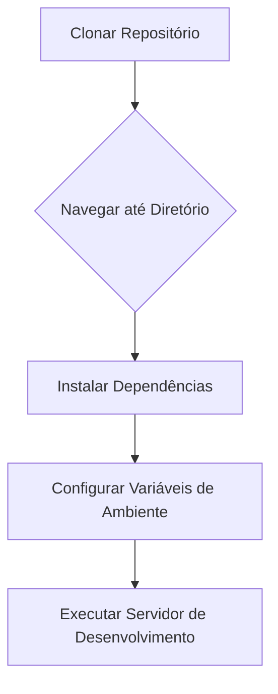

<details>
<summary>Relevant source files</summary>

- [docsteste/deployment.md](https://github.com/guilhermedreis/tecido-lote-gestor/blob/main/docsteste/deployment.md)
</details>

# Processo de Implantação

O "Processo de Implantação" do projeto *tecido-lote-gestor* abrange as etapas necessárias para configurar e executar a aplicação localmente. Este documento detalha o processo de instalação e configuração, proporcionando um guia claro para desenvolvedores que desejam contribuir ou testar o sistema.

## Configuração Local

### Pré-requisitos

Antes de iniciar a instalação, é necessário ter o Node.js e npm (ou yarn) instalados na máquina de desenvolvimento.

### Etapas de Instalação

1. **Clonar o repositório:**
   ```bash
   git clone https://github.com/GuilhermeDReis/tecido-lote-gestor.git
   ```

2. **Navegar até o diretório do projeto:**
   ```bash
   cd tecido-lote-gestor
   ```

3. **Instalar dependências:**
   ```bash
   npm install
   ```
   ou
   ```bash
   yarn install
   ```

4. **Configurar variáveis de ambiente:**
   O projeto utiliza variáveis de ambiente, especialmente para a integração com o Supabase. Estas são normalmente armazenadas em um arquivo `.env` no diretório raiz.

5. **Executar o servidor de desenvolvimento:**
   ```bash
   npm run dev
   ```
   ou
   ```bash
   yarn dev
   ```
   O servidor de desenvolvimento normalmente está acessível em `http://localhost:5173`.



## Fluxo de Desenvolvimento

O fluxo de desenvolvimento envolve a edição de arquivos de origem e a utilização do servidor de desenvolvimento para recarregar automaticamente as mudanças. O projeto foi construído utilizando tecnologias como Next.js, TypeScript, Tailwind CSS e Prisma, que fornecem uma base moderna e escalável.

## Considerações Finais

O processo de implantação é essencial para permitir que desenvolvedores configurem rapidamente o ambiente de desenvolvimento e comecem a trabalhar no projeto. A documentação deve ser expandida para incluir instruções detalhadas sobre a implantação em ambientes de produção, como configuração de servidor e banco de dados.