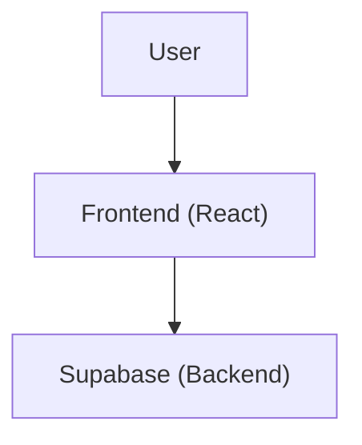
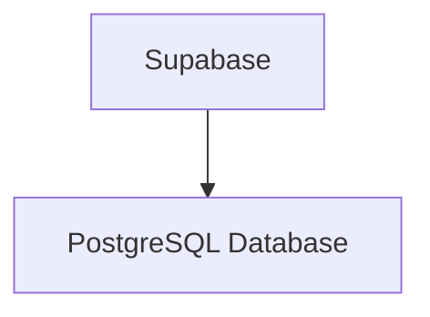
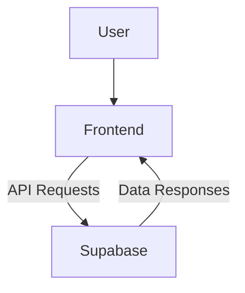

<details>
<summary>Relevant source files</summary>

- [docsteste/overview.md](https://github.com/guilhermedreis/tecido-lote-gestor/blob/main/docsteste/overview.md)
</details>

# Visão Geral da Arquitetura

O projeto "tecido-lote-gestor" é uma aplicação web desenvolvida para gerenciar lotes de tecidos, permitindo aos usuários registrar, atualizar, buscar e excluir informações sobre lotes, incluindo detalhes como cliente, comprimento do rolo e localização de armazenamento. A arquitetura da aplicação combina tecnologias modernas como React, TypeScript e Supabase, fornecendo uma interface de usuário interativa e um backend robusto.

## Arquitetura Geral

A aplicação segue uma arquitetura cliente-servidor padrão, onde o frontend é responsável pela interação com o usuário e o backend gerencia a lógica de negócios e o armazenamento de dados.

### Frontend (React/TypeScript)

O frontend é construído utilizando React e TypeScript, focando na apresentação de dados e na interação do usuário. A estrutura é baseada em componentes reutilizáveis, utilizando bibliotecas como Radix UI e Shadcn/ui para componentes pré-construídos.



### Backend (Supabase)

O Supabase serve como a solução de backend, oferecendo serviços de banco de dados, autenticação e endpoints de API. A aplicação se conecta a um banco de dados PostgreSQL, onde as tabelas incluem clientes, lotes e perfis de usuários.



## Fluxo de Dados

Os usuários interagem com a interface do React, que se comunica com o backend do Supabase para operações de recuperação e modificação de dados. O fluxo de dados é gerenciado por meio de hooks personalizados que abstraem a lógica de acesso a dados.



### Componentes Principais

| Componente/Funcionalidade | Descrição |
|---------------------------|-----------|
| Gerenciamento de Clientes   | Permite aos usuários criar, atualizar e excluir informações de clientes. |
| Gerenciamento de Lotes      | Habilita o gerenciamento de detalhes de lotes de tecido, incluindo vinculação a clientes. |
| Busca                       | Fornece funcionalidade de busca para encontrar lotes específicos com base em critérios. |
| Autenticação                | Utiliza autenticação do Supabase para acesso seguro dos usuários. |

## Exemplo de Código

O seguinte exemplo ilustra como um cliente pode ser criado utilizando a função `criarCliente` no hook `useClientes`:

```typescript
// src/hooks/useClientes.ts
const criarCliente = async (cliente: Cliente) => {
  const { data, error } = await supabase
    .from('clientes')
    .insert([cliente])
    .select()
    .single();

  if (error) {
    throw error;
  }

  return data;
};
```

## Considerações Finais

A arquitetura do "tecido-lote-gestor" proporciona uma solução escalável e moderna para o gerenciamento de lotes de tecidos. A combinação de React, TypeScript e Supabase não apenas facilita o desenvolvimento, mas também garante uma experiência de usuário fluida e responsiva. O fluxo de dados bem definido e a estrutura modular da aplicação permitem futuras expansões e melhorias de funcionalidade.