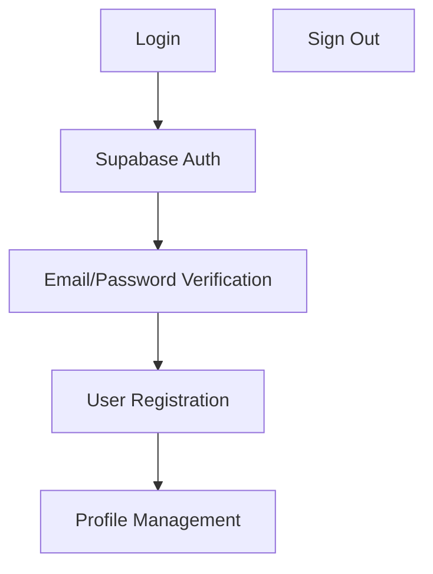

<details>
<summary>Relevant source files</summary>

- [src/pages/ConsultaLote.tsx](https://github.com/guilhermedreis/tecido-lote-gestor/blob/main/src/pages/ConsultaLote.tsx)
- [src/hooks/useClientes.ts](https://github.com/guilhermedreis/tecido-lote-gestor/blob/main/src/hooks/useClientes.ts)
- [src/pages/ConsultaClientes.tsx](https://github.com/guilhermedreis/tecido-lote-gestor/blob/main/src/pages/ConsultaClientes.tsx)
- [src/pages/CadastroLote.tsx](https://github.com/guilhermedreis/tecido-lote-gestor/blob/main/src/pages/CadastroLote.tsx)
- [src/components/ui/select.tsx](https://github.com/guilhermedreis/tecido-lote-gestor/blob/main/src/components/ui/select.tsx)
</details>

# Welcome to tecido-lote-gestor

Welcome to the tecido-lote-gestor project, a comprehensive system designed for managing textile lotteries and their associated processes. This documentation serves as your guide through the intricate architecture and features of this software application.

## Detailed Sections

### Introduction
The tecido-lote-gestor is built on a modular design philosophy with a focus on scalability and ease of maintenance. The project consists of several interconnected components, each responsible for specific functions:

- **Frontend:** Handles user interactions such as form submissions, navigation, and display of data.
- **Backend:** Processes business logic, manages database access, and handles authentication.
- **Database:** Stores critical information about textile lots, clients, and their transactions.

The project leverages modern technologies like TypeScript for type safety and React.js for its intuitive UI/UX. It is architected to ensure high performance through efficient data management strategies and minimal latency in response times.

### Technical Architecture
The backend utilizes Node.js with Express.js as the web framework, leveraging Supabase for database interactions. The frontend integrates seamlessly with the backend via API calls, ensuring a responsive user experience without requiring clientside JavaScript (JS).

### Key Features

#### User Authentication
- **Supabase**: Handles authentication through email and password-based sign-in.
- **Auth Pages**:
  - [Auth.tsx](https://github.com/guilhermedreis/tecido-lote-gestor/blob/main/src/pages/Auth.tsx): Manages user login, registration, and profile management.

#### Client Data Management
- **useClientes.ts**: Provides a hook to fetch and manage client data.
- **CadastroLote.tsx** and **ConsultaLote.tsx**: Implement forms for creating new lots and retrieving lot details.
- **ConsultaClientes.tsx**: Lists all registered clients with their information.

### Code Examples

```javascript
// Example from useClientes.ts
const clientes = useSelector(selectClientes);
```

```typescript
// Example from ConsultaLote.tsx
const loteEncontrado = useSelector(selectLotePorCodigo);

// Example from ConsultaClientes.tsx
const clientesFiltrados = clients.filter(client => client.nome.toLowerCase().includes(searchTerm.toLowerCase()));

// Example from CadastroLote.tsx
const loteData: Lote = {
  nome_lote,
  gramatura,
  fio,
  cor,
  artigo,
  tecelagem,
  numero_maquina_tear
};
```

### Diagrams

#### Flowchart: User Authentication Process


#### Sequence Diagram: Client Data Fetching
```mermaid
sequenceDiagram
    Actor cliente
    -- login ->> server: authenticate
    Server->>DB: execute query (SELECT * FROM clientes WHERE id = $id)
    DB-->>Server: response with client data
    Server->>cliente: retrieve user details
```

#### Class Diagram: Client Management Logic
```mermaid
classDiagram
    Cliente <|-- ClienteService
                    |   .load(clientId) ->> viewClientDetails: Display Client Details

```

### Tables

| Feature               | Description                                                                                           |
|-----------------------|-----------------------------------------------------------------------------------------------------|
| **Authentication**    | Users log in using email and password.                                                                    |
| **Database Schema**   | Stores lot information, client details, transaction records, etc., with appropriate data types and constraints. |
| **Data Model Fields** | - `name_lote` (Lot Name)                                                                                   |
|                       | - `gramatura` (Linen Weight)                                                                                 |
|                       | - `fio` (Thread Count)                                                                                     |
|                       | - `cor` (Color Code)                                                                                       |

### Conclusion

This project is designed to be robust, scalable, and maintainable. The use of modern frameworks like React for the frontend and Supabase for database management ensures that the application can handle large amounts of data efficiently while providing a seamless user experience.

Please let us know if you need further details or clarification on any part of this architecture!